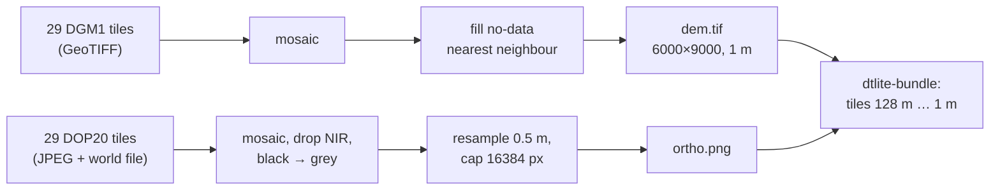

# Terrain & imagery

## Sources

| | Terrain | Imagery |
|---|---|---|
| Product | **DGM1** — digital terrain model from airborne laser scanning | **DOP20** — digital orthophotos |
| Provider | HVBG (Hessische Verwaltung für Bodenmanagement und Geoinformation), Geobasis Hessen | same |
| Resolution | 1 m grid, vertical accuracy about ±0.3 m | 20 cm pixels (RGB + near-infrared) |
| Reference | ETRS89 / UTM zone 32N (EPSG:25832), heights DHHN2016 (≈ metres above sea level) | same |
| Licence | Datenlizenz Deutschland – Zero – 2.0 (free reuse, no attribution required) | same |
| Acquisition date | **not recorded** (see below) | **not recorded** |

## How it was fetched

HVBG's download centre is a free shop without stable per-tile links, so the tiles were
ordered by hand (Landkreis Darmstadt-Dieburg → Gemeinde Messel). `messelpit/tools/
download_messel_data.py` only opens the right pages. **29 DGM1 + 29 DOP20 tiles** of
1 × 1 km were used, listed in `messelpit/data/tile_manifest.txt`. They form an
irregular footprint inside the 6 × 9 km scene — the Gemeinde's area plus extras, not a
rectangle.

## How it was prepared (`messelpit/tools/prep_rasters.py`)

- **The scene frame**: the south-west corner of the scene is UTM 480000 E / 5526000 N;
  the viewer works in metres from there (x east, y north, z = elevation).
- **No-data**: about **46 %** of the 6 × 9 km rectangle has no tile. Those cells were
  filled with the value of the nearest measured cell — which is why the edges show flat
  grey-green plains. They are filler, not terrain. (Marking them so the viewer can leave
  them out is on the to-do list.)
- **Imagery**: the near-infrared channel is dropped; black (unmapped) pixels become
  grey; the mosaic is resampled to 0.5 m and capped at 16384 px on the long side, so
  the viewer's imagery is ~0.55 m per pixel, coarser than the 20 cm original.
- **Elevation** in the scene: 103.8 m (pit floor) to 228.0 m, mean 170.5 m. The mean is
  the pivot of the height exaggeration.

## In the viewer

`dtlite-bundle` cuts the terrain into a pyramid of 8 levels — 128 m cells for the whole
scene down to **1 m** cells — and the imagery into matching 256-pixel tiles. The viewer
loads fine tiles only near the camera.

## Unknowns

- **When** the laser scan and the photos were flown is not recorded; the HVBG metadata
  pages would say. The terrain is "recent" — it shows the pit as it is today, not as in
  2003 (compare the station heights, [Monitoring stations](04-monitoring-stations.md)).
