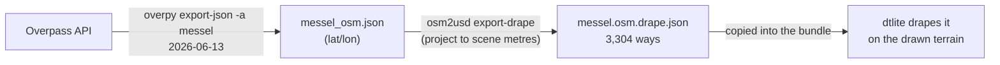

# OSM layer (roads and buildings)

The **Roads** and **Buildings** layers come from **OpenStreetMap** (© OpenStreetMap
contributors, Open Database License 1.0), fetched once and draped on the terrain.

## From OpenStreetMap to the viewer

1. **Query** — `overpy` (`D:\python\overpy`) ran the scene's area query ("messel":
   49.88606–49.96718 N, 8.72159–8.80479 E, the 6 × 9 km box) against the Overpass API
   on **2026-06-13 12:41 UTC**. Only two kinds of things are exported: **highways** and
   **buildings**.
2. **Projection** — `osm2usd export-drape` projects every node to scene metres (UTM 32N
   minus the scene's SW corner) and sorts each way into a **class group**. It writes
   `messelpit/out/messel.osm.drape.json`: 3,304 ways (≈2,100 buildings, ≈1,200 roads
   and paths). The same file feeds both viewers.
3. **Draping** — the viewer builds the geometry itself, on the terrain actually drawn:
   - **roads** become ribbons following the ground, 0.5 m above it;
   - **buildings** are extruded footprints, standing on the lowest ground under them.

## Class groups, widths and colours

OSM tags are bucketed into a few groups (the list comes from the data; unknown tags
fall into *hwother* / *bldother*):

| Group | Contains (OSM `highway=` / `building=`) | Road width | Colour |
|---|---|---|---|
| motorway | motorway, motorway_link | 12 m | orange |
| street | trunk … tertiary, unclassified | 7 m | light grey |
| living | residential, living_street, pedestrian, cycleway | 5 m | pale green |
| service | service | 4 m | grey |
| trail | track, footway, path, bridleway | 1.5 m | brown |
| residency | house, detached, apartments, yes, shed, … | — | tan |
| parking, office, retail, public, farm, school, religion, ruin | (by building type) | — | per group |

Widths and colours are `osm2usd`'s defaults (`group.py`, `materials.py`), so the Kit
viewer shows the same.

## Heights of buildings

OSM rarely records a height. The rule: the tagged `height` if present, else
`levels × 3 m`, else **6 m**. So almost every building here is a 6 m box — a
placeholder, not a survey.

## Under exaggeration

Roads are re-draped vertex by vertex onto the stretched terrain. Buildings are **not**
stretched: they keep their height and move up or down with the ground under them.
