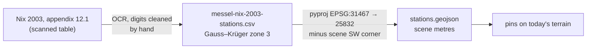

# Monitoring stations (Nix 2003)

The coloured **pins** are the measuring network set up to watch the pit's slopes, which
have been sliding since the 1930s. The stations are listed, with coordinates, in the
appendix of:

> Nix, T. (2003): Untersuchung der ingenieurgeologischen Verhältnisse der Grube Messel
> (Darmstadt) im Hinblick auf die Langzeitstabilität der Grubenböschungen. —
> Geologische Abhandlungen Hessen 112, 159 pp., HLUG, Wiesbaden.

The PDF is in `dthub/docs/`; notes on the whole monograph are in
`messelpit/docs/messel-nix-2003-notes.md`.

## What the pins are

| Colour | Type | Count | What it measures |
|---|---|---|---|
| dark blue | deep well (GW 1–5) | 5 | groundwater in the crystalline rock, 30–45 m deep |
| light blue | piezometer (KP 101–525) | 100 | shallow groundwater, 3 m |
| red | inclinometer (IN 1–28) | 28 | sideways movement down a 19.5–65 m tube; **"sheared off"** ones were broken by the slides — which itself marks the slip surfaces at 7–49 m depth |
| yellow | fixed geodetic point (F1–F5) | 5 | survey reference points |
| beige | temporary geodetic point (6000–9032) | 33 | GPS survey points |

**Click a pin** to see its name, type, depth, remark, its ground height in the 2001
table and today's ground height at the same spot.

## How the positions were made

- The table gives **Gauss–Krüger zone 3** coordinates (DHDN, EPSG:31467), the old German
  system. They are transformed to UTM 32N with a standard datum shift (≈1 m accuracy,
  no grid file) by `messelpit/tools/export_web.py`.
- The table was **scanned text**: the digits were read by OCR and cleaned by hand.

## How good are they?

Checked against today's terrain: the 2001 ground heights of the stations match the DGM1
at a **median of +0.03 m**, and **97 % are within 2 m**. So both the transform and the
transcription hold. Outliers:

- **IN23** is listed at 116.18 m but the ground there is ~160 m (+43.9 m). The scan
  confirms the book really prints 116,18, so this is a **misprint in Nix**, not a
  transcription error. The height is the likely mistake (probably 160,18): the ground at
  the printed position is 160.03 m, and no one-digit slip in the coordinates reaches
  ground at ~116 m. The viewer keeps the printed value and flags it.
- Points 9002 / 9003 (−6 m) lie outside the pit; 9032 (+3.6 m).

The pins stand on **today's** ground, not the 2001 height, so they never float or sink
where the slopes have moved.
