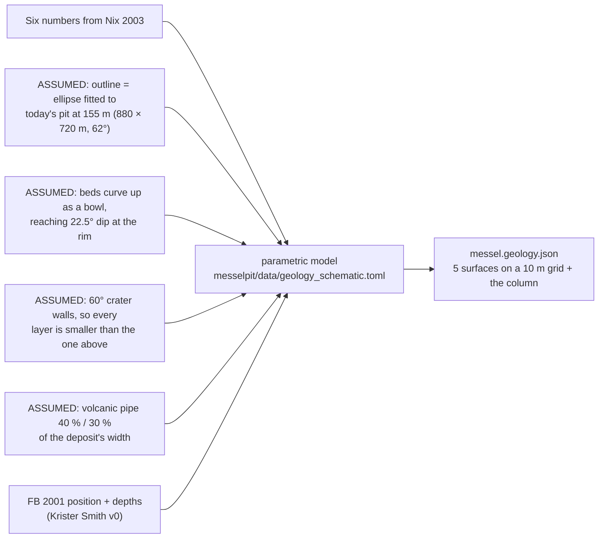

# Geology (schematic)

The **Geology** layer shows the rock layers under the pit as see-through sheets, and
the research borehole **FB 2001** as a striped column. The **Section** tool cuts through
them. It is a **schematic** model: the depths are published values; the **shapes**
between them are invented to be plausible. Treat it as an illustration, not a map.

In the layer panel, each sheet and the borehole has its own **checkbox**, and a
**Sheet opacity** slider sets how see-through the sheets are. Your choice is remembered
with the scene.

## The layer stack (top to bottom)

The deposit is the fill of a maar: a crater blasted by an eruption ~48 million years ago,
then filled by a lake whose muds became the oil shale.

| Unit | What it is | At FB 2001 (depth below ground) | Colour |
|---|---|---|---|
| *(mined away)* | oil shale removed 1885–1971; the pale "lid" (**Pre-mining ground surface**) marks the ground before mining. It is deliberately **flat**, at 168 m, over the deposit only: a schematic level, not a reconstructed landscape. It **starts hidden** (from inside the pit its underside reads as a grey sheet in the sky); tick it to show it | — | pale |
| **Middle Messel-Fm** | the laminated **oil shale** (Schwarzpelit) — the fossil layer | 0–94 m | black |
| **Lower Messel-Fm** | breccias, turbidites, sands and silts washed in from the crater walls | 94–228 m | brown |
| Tuffitic sediment | transition below the lake fill | 228–240 m | sand |
| **Lapilli tuff** | ash and lapilli of the eruption itself | 240–373 m | green |
| **Diatreme breccia** | shattered rock of the collapsed volcanic vent | 373–433 m (end of hole) | purple |
| *frame* | the older rocks the crater was cut into (Rotliegend sandstones, granodiorite, diorite) — **not modelled** | — | grey |

## Where the numbers come from

**FB 2001** (position, and the boundaries at 94, 228 and 373 m) is from **Krister
Smith's borehole database** (messel-dt v0, 2026-10): GK3 R 3482757.75 / H 5531296.42,
collar 105.9 m NN. Today's DGM1 there reads 105.7 m. The bowl's lowest point is put at
FB 2001, which Nix places in the structural low. The rest is from Nix:

All from **Nix (2003)** (Geol. Abh. Hessen 112; book page = PDF page − 1):

| Value | Nix | Used for |
|---|---|---|
| FB 2001: 229 m of lake fill; ~100 m oil shale; breccias to 208 m; fine sands 208–229; tuffite to 240; lapilli tuff 240–373; breccia 373–433 | p. 30 | the column; unit thicknesses |
| base of the oil shale ≈ **+6 m** above sea level in the structural low (boreholes 6/24 and FB 2001); ~99 m left, ~160 m before mining | p. 35 | top of the Lower Fm |
| base of the Messel-Fm (lake fill) ≈ **−129 m** in FB 2001 | p. 37 | top of the tuffite |
| beds flat in the centre, dipping **20–25°** toward the rims; deepest part over the diatreme in the **SE**; walls are listric faults | p. 37 | the bowl shape |
| slide scarps at the pit rim at ~160–170 m | p. 46 | the top of the funnel |
| W/E/S pit rims already at today's extent by 1957 | p. 45 | pit outline ≈ deposit outline |

## What is invented (the shapes)

Every assumption is a line in `messelpit/data/geology_schematic.toml`, marked
`ASSUMPTION`, with the Nix page for every number. Change it there and rerun
`messelpit/tools/export_web.py`.

## The section cut

The cut face is computed along the cut line from the ground and the surfaces, with
these rules (the `[fills]` section of the same file): between the ground and the first
surface below it lies oil shale; each unit reaches down to the next surface, but no
more than its thickness in FB 2001 (e.g. tuffite 12 m); below that, and wherever no
surface exists, is the grey frame. Where the pre-mining lid is above today's ground,
the gap is drawn pale: that is what was dug out.

## Boreholes (Krister Smith's database)

The **Boreholes** layer (off at start) shows **43 boreholes** from Krister Smith's
Messel borehole database, v0 test snapshot (repository `messel-dt`, `data/v0`). Each is
a thin column, coloured by unit:

| Colour | Between | Unit |
|---|---|---|
| black | today's ground and the base of the oil shale | Middle Messel-Fm |
| brown | the base of the oil shale and the base of the lake fill | Lower Messel-Fm |
| sand | the base of the lake fill and the top of the basement | (in v0 only FB 4 reaches it) |

Click a column for its contacts in m NN. Two things to know:

- v0 has **no collar heights**, so the columns start at **today's** ground. Where a
  contact lies above today's ground it was mined away and is not drawn.
- It is a **starter subset**: 44 holes and 90 contacts. The full database has 811 holes
  and 195 true oil-shale bases (Krister's QC note: in 330 more holes the drill stopped
  inside the oil shale, so their "base" is only the end of the hole).
  Four of the holes are inclinometers from the monitoring network (IN 18, 20, 25, 27).

## Better data is coming

- **Krister Smith's GemPy model** ("Messel DT v0"): 811 boreholes, 195 picks of the
  oil shale's base. His plots (2026-09-29) agree with this schematic on the depth of the
  low (≈ −130 m) and roughly on its position, and suggest the shape is wrong: the deep
  part looks like a narrow trough, and the deposit runs north–south. When the computed
  surfaces arrive they replace this model. Details: `dthub/specs/messel-subsurface-model.md`.
- **Möller (1989)**, an unpublished stratigraphy of the pit with marker beds and
  microfault maps (in `messel-dt/docs`), and **Harms' geological map** (1:25,000, with a
  cross-section, `messel_karten/MGKd_*.psd`) — both not yet used.
