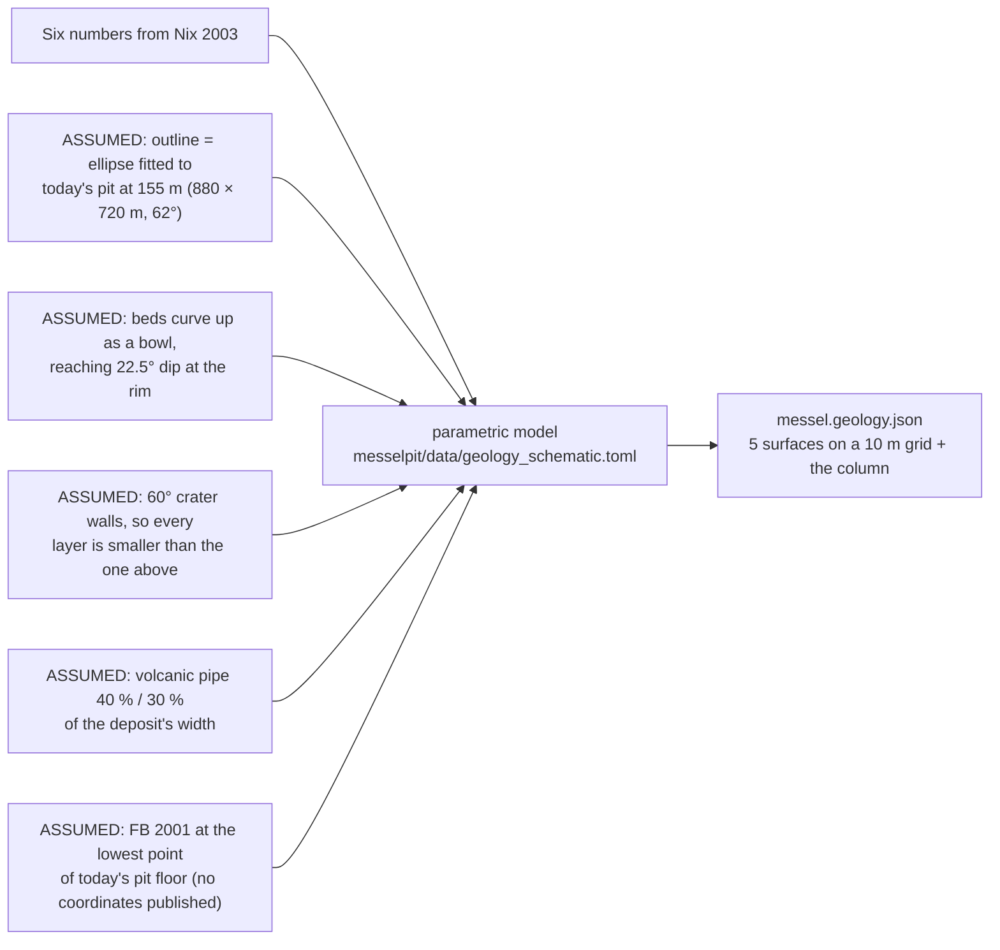

# Geology (schematic)

The **Geology** layer shows the rock layers under the pit as see-through sheets, and
the research borehole **FB 2001** as a striped column. The **Section** tool cuts through
them. It is a **schematic** model: the depths are published values; the **shapes**
between them are invented to be plausible. Treat it as an illustration, not a map.

In the layer panel, each sheet and the borehole has its own **checkbox**, and a
**Sheet opacity** slider sets how see-through the sheets are. Your choice is remembered
with the scene.

## The layer stack (top to bottom)

The deposit is the fill of a maar: a crater blasted by an eruption ~48 million years ago,
then filled by a lake whose muds became the oil shale.

| Unit | What it is | At FB 2001 (depth below ground) | Colour |
|---|---|---|---|
| *(mined away)* | oil shale removed 1885–1971; the pale "lid" (**Pre-mining ground surface**) marks the ground before mining. It is deliberately **flat**, at 168 m, over the deposit only: a schematic level, not a reconstructed landscape. It **starts hidden** (from inside the pit its underside reads as a grey sheet in the sky); tick it to show it | — | pale |
| **Middle Messel-Fm** | the laminated **oil shale** (Schwarzpelit) — the fossil layer | 0–100 m | black |
| **Lower Messel-Fm** | breccias, turbidites, sands and silts washed in from the crater walls | 100–229 m | brown |
| Tuffitic sediment | transition below the lake fill | 229–240 m | sand |
| **Lapilli tuff** | ash and lapilli of the eruption itself | 240–373 m | green |
| **Diatreme breccia** | shattered rock of the collapsed volcanic vent | 373–433 m (end of hole) | purple |
| *frame* | the older rocks the crater was cut into (Rotliegend sandstones, granodiorite, diorite) — **not modelled** | — | grey |

## Where the numbers come from

All from **Nix (2003)** (Geol. Abh. Hessen 112; book page = PDF page − 1):

| Value | Nix | Used for |
|---|---|---|
| FB 2001: 229 m of lake fill; ~100 m oil shale; breccias to 208 m; fine sands 208–229; tuffite to 240; lapilli tuff 240–373; breccia 373–433 | p. 30 | the column; unit thicknesses |
| base of the oil shale ≈ **+6 m** above sea level in the structural low (boreholes 6/24 and FB 2001); ~99 m left, ~160 m before mining | p. 35 | top of the Lower Fm |
| base of the Messel-Fm (lake fill) ≈ **−129 m** in FB 2001 | p. 37 | top of the tuffite |
| beds flat in the centre, dipping **20–25°** toward the rims; deepest part over the diatreme in the **SE**; walls are listric faults | p. 37 | the bowl shape |
| slide scarps at the pit rim at ~160–170 m | p. 46 | the top of the funnel |
| W/E/S pit rims already at today's extent by 1957 | p. 45 | pit outline ≈ deposit outline |

## What is invented (the shapes)

Every assumption is a line in `messelpit/data/geology_schematic.toml`, marked
`ASSUMPTION`, with the Nix page for every number. Change it there and rerun
`messelpit/tools/export_web.py`.

## The section cut

The cut face is computed along the cut line from the ground and the surfaces, with
these rules (the `[fills]` section of the same file): between the ground and the first
surface below it lies oil shale; each unit reaches down to the next surface, but no
more than its thickness in FB 2001 (e.g. tuffite 11 m); below that, and wherever no
surface exists, is the grey frame. Where the pre-mining lid is above today's ground,
the gap is drawn pale: that is what was dug out.

## Better data is coming

- **Krister Smith's borehole model** ("Messel DT v0", GemPy): 811 boreholes, 195 picks
  of the oil shale's base. Two plots received on 2026-09-29 (no data yet). They agree
  with this schematic on the depth of the low (≈ −130 m) and roughly on its position,
  and suggest the shape is wrong: the deep part looks like a narrow trough, and the
  deposit runs north–south. When his export arrives it replaces this model. Details:
  `dthub/specs/messel-subsurface-model.md`.
- **Harms' geological map** (1:25,000, with a cross-section through the pit), in
  `messel_karten/MGKd_*.psd`, and a 2003 Senckenberg site plan that marks FB 2001's
  real position — both not yet used.
